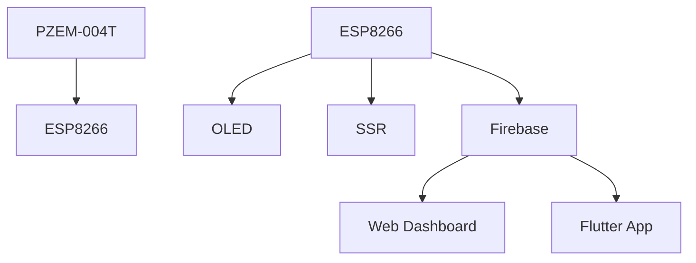

# ⚡ Smart Power Monitoring Device – IoT Energy Monitoring for Dormitory Rooms

> A smart, compact, real-time energy monitoring system designed for student dormitories, allowing users to monitor power consumption and control devices remotely via Web & Mobile App.

---

## 🚀 Key Features

- ⚡ Measure voltage, current, power, and energy consumption
- 📲 Real-time monitoring via Web Dashboard & Android Mobile App
- 🔌 Remote ON/OFF control for low-power devices
- 🛡️ Protection against overvoltage and overcurrent
- 🏠 Multiple device support across dormitory rooms
- 📦 Data backup when offline (stored in Flash memory for up to 2 months)
- 🌐 Firebase-based cloud data with authentication & real-time sync

---

## 🖥️ Web Dashboard

> Web interface built with Node-RED. Offers real-time visualization of power data, control buttons, and alerts.

---

## 📱 Mobile App (Flutter)

> Flutter-based Android app for tracking energy usage, receiving alerts, and controlling connected devices.

---

## 🔧 Hardware Components

| Component | Description |
|----------|-------------|
| **ESP8266 D1 Mini** | Main microcontroller board |
| **PZEM-004T** | Voltage/Current/Power/Energy sensor |
| **OLED 0.96"** | Real-time local display |
| **SSR G3MB-202P** | Solid-state relay for remote switching |
| **HLK-PM01** | AC-DC converter (230V AC to 5V DC) |

3D enclosure designed with **Inventor** and prepared for printing using **Ultimaker Cura**.

---

## 📚 Software Stack

| Layer | Tools & Technologies |
|-------|-----------------------|
| Firmware | Arduino IDE, C++ |
| Cloud | Firebase (Realtime DB, Auth, Hosting) |
| App | Flutter (Android) |
| Web | Node-RED |
| Communication | MQTT, HTTP, WebSocket |
| Platform Compatibility | Web, Android, iOS (planned), Desktop |

---

## 🧠 System Overview

## 🛠️ Installation & Usage

### Flashing Firmware
1. Clone or download the repository to your local machine.
2. Open Arduino IDE and load the `firmware/` directory file for ESP8266.
3. Select the correct board (ESP8266) and port in the Arduino IDE.
4. Flash the firmware to your ESP8266 by clicking the **Upload** button in Arduino IDE.

### Configuration
1. Set your Wi-Fi and Firebase credentials in the `config.h` file.
    - Replace the placeholders for `SSID`, `PASSWORD`, and Firebase credentials with your actual information.

### Deploy Node-RED Dashboard
1. Install Node-RED on your server or Raspberry Pi.
2. Deploy the dashboard using the provided flow or configure it via the Node-RED editor.
3. Alternatively, host your Node-RED dashboard via Firebase Hosting.
    - Follow the Firebase documentation for setting up Firebase Hosting and deploying your dashboard.

### Install APK on Android
1. Download and install the APK file to your Android phone.
2. Launch the app and connect it to your Firebase database.

### Monitor & Control
Once the system is set up, you can monitor and control the hardware (relays, sensors, etc.) from anywhere with an internet connection through the web or mobile app interface.

---

## 📈 Results

### Real-World Testing
- Hardware tested in a real dormitory environment.
- Stable real-time data flow and relay switching within **100-300ms**.

### Offline Data Logging
- Offline data logging with automatic sync once Wi-Fi reconnects.

---

## 🔮 Future Improvements

### 🔧 Hardware
- Improve the durability and aesthetics of the enclosure.
- Add manual control buttons for local operation.
- Increase relay capacity for high-load control applications.
- Add backup power (battery or supercapacitor) for system reliability.

### 💻 Software
- Optimize the UI/UX for both Web and Mobile App.
- Add payment tracking and smart billing features for better dormitory management.
- Integrate with Mesh networking for improved scalability and reliability.
- Improve alerting for loss of Wi-Fi and power outages.

---

