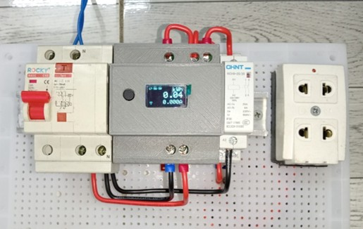
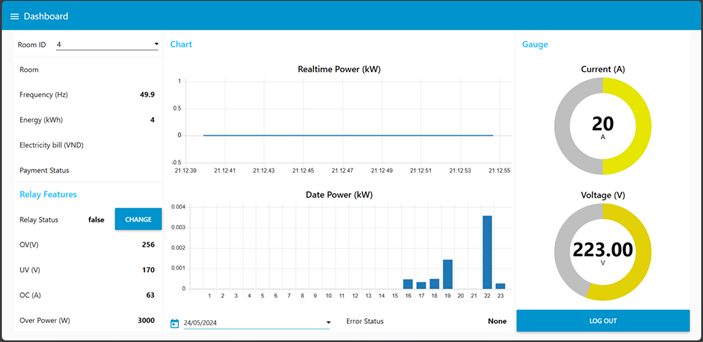
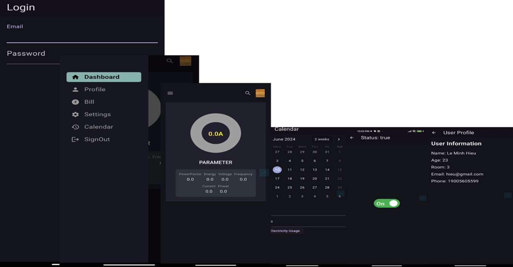
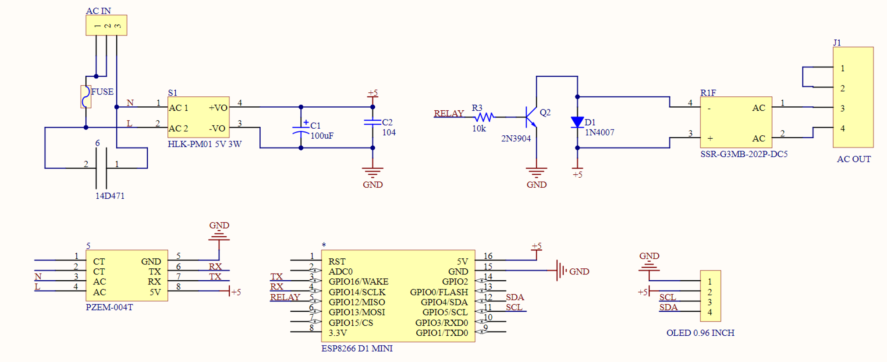
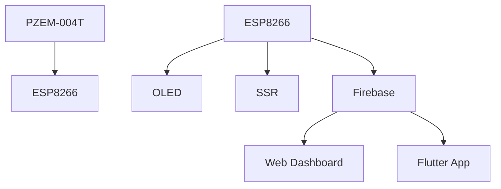

# ⚡ Smart Power Monitoring Device – IoT Energy Monitoring for Dormitory Rooms

  

> A smart, compact, real-time energy monitoring system designed for student dormitories, allowing users to monitor power consumption and control devices remotely via Web & Mobile App.

---

## 🚀 Key Features

- ⚡ Measure voltage, current, power, and energy consumption
- 📲 Real-time monitoring via Web Dashboard & Android Mobile App
- 🔌 Remote ON/OFF control for low-power devices
- 🛡️ Protection against overvoltage and overcurrent
- 🏠 Multiple device support across dormitory rooms
- 📦 Data backup when offline (stored in Flash memory for up to 2 months)
- 🌐 Firebase-based cloud data with authentication & real-time sync

---

## 🖥️ Web Dashboard

  

> Web interface built with Node-RED. Offers real-time visualization of power data, control buttons, and alerts.

---

## 📱 Mobile App (Flutter)

  

> Flutter-based Android app for tracking energy usage, receiving alerts, and controlling connected devices.

---

## 🔧 Hardware Components

| Component | Description |
|----------|-------------|
| **ESP8266 D1 Mini** | Main microcontroller board |
| **PZEM-004T** | Voltage/Current/Power/Energy sensor |
| **OLED 0.96"** | Real-time local display |
| **SSR G3MB-202P** | Solid-state relay for remote switching |
| **HLK-PM01** | AC-DC converter (230V AC to 5V DC) |

3D enclosure designed with **Inventor** and prepared for printing using **Ultimaker Cura**.

---

## 📐 PCB & 3D Design
## 🔌 PCB Design (Altium Designer)
The printed circuit board was designed using Altium Designer, including both the schematic and the top/bottom layer layout. A two-layer design optimizes space and ensures reliable operation.

   

## 🧱 Enclosure Design (Autodesk Inventor)
The case was modeled in Autodesk Inventor to precisely fit the PCB and components inside. The design ensures both structural protection and ease of assembly.

   
 
  

---

## 📚 Software Stack

| Layer | Tools & Technologies |
|-------|-----------------------|
| Firmware | Arduino IDE, C++ |
| Cloud | Firebase (Realtime DB, Auth, Hosting) |
| App | Flutter (Android) |
| Web | Node-RED |
| Communication | MQTT, HTTP, WebSocket |
| Platform Compatibility | Web, Android, iOS (planned), Desktop |

---

## 🧠 System Overview

